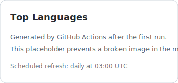

### Hi there, I'm Leroll 👋
---
<table align="center">
  <tr>
    <td align="center">
      
    </td>
    <td align="center">
      
    </td>
  </tr>
</table>

***Turning coffee into intelligence, one repo at a time✨***

<!-- Auto-managed block: do not edit content between START and END markers. -->
<!-- README:STATS:START -->

  

<!-- README:STATS:END -->
<!-- 开源统计 -->
<!-- 2025-05-16 init-->
<!-- 2025-05-16 C -->
<!-- 2025-06-06 C+ -->
<!-- 2026-05-20 B- 太久没看, 这一天查了一下 -->

<!-- Auto-managed block: do not edit content between START and END markers. -->
<!-- README:VIEWS:START -->
<!--

  

-->
<!-- README:VIEWS:END -->
<!-- 主页浏览数量 -->
